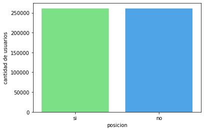
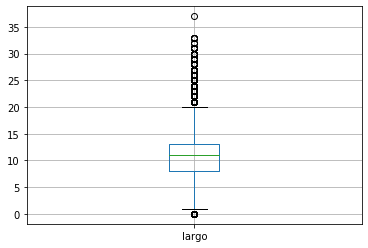
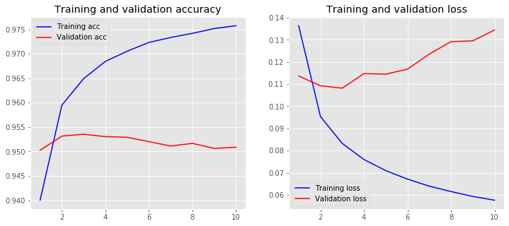
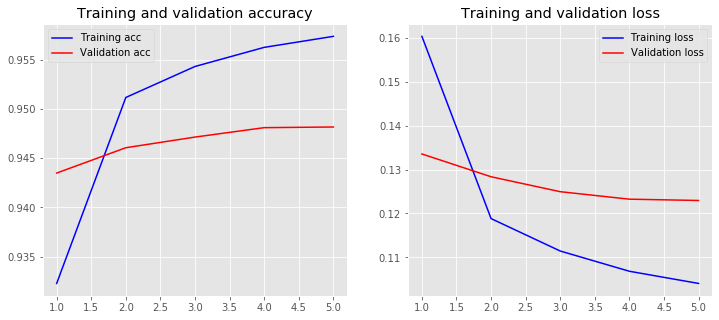

# Laboratorio 4: Aprendizaje Supervisado

> **Análisis de las Posiciones del Aborto en Twitter**
> *Diplomatura en Ciencias de Datos, Aprendizaje Automático y sus aplicaciones.*
> *Integrantes: 
    - Carlos Piaggio
    - Juan Pablo Analian
> Enunciado del TP: https://github.com/gonzigaran/AbortoTwitter/blob/master/lab4-AS.md    
> Pasos realizados
    - ToDo!
    - ToDo!    


```python
#!pip install stop-words #https://pypi.org/project/stop-words/
#!pip install nltk
nltk.download('stopwords')
nltk.download('punkt')
nltk.download('wordnet')
```


```python
import pickle
import pandas as pd
import re
import nltk
from nltk.corpus import stopwords
from nltk.stem import WordNetLemmatizer
from sklearn.feature_extraction.text import TfidfVectorizer, CountVectorizer
from sklearn.model_selection import train_test_split
from sklearn.feature_selection import chi2
import numpy as np
import matplotlib.pyplot as plt
import seaborn as sns
from stop_words import get_stop_words
```


```python
df_tweets_junio_full =  pd.read_csv('./out/mensajes-junio-clasificados.csv',   parse_dates=['created_at'])
```


```python
print("shape:",df_tweets_junio_full.shape)
display(df_tweets_junio_full.head(5))
```

    shape: (1041585, 18)


<div>
<style scoped>
    .dataframe tbody tr th:only-of-type {
        vertical-align: middle;
    }

    .dataframe tbody tr th {
        vertical-align: top;
    }

    .dataframe thead th {
        text-align: right;
    }
</style>
<table border="1" class="dataframe">
  <thead>
    <tr style="text-align: right;">
      <th></th>
      <th>Unnamed: 0</th>
      <th>id</th>
      <th>created_at</th>
      <th>favorite_count</th>
      <th>retweet_count</th>
      <th>full_text</th>
      <th>posicion</th>
      <th>favorited</th>
      <th>retweeted</th>
      <th>user_name</th>
      <th>user_id</th>
      <th>original_id</th>
      <th>ht_contra</th>
      <th>ht_favor</th>
      <th>ht_indefinidos</th>
      <th>no_clasificados</th>
      <th>real_retweet_count</th>
      <th>real_favorite_count</th>
    </tr>
  </thead>
  <tbody>
    <tr>
      <td>0</td>
      <td>0</td>
      <td>1005600427080110080</td>
      <td>2018-06-09 23:59:59+00:00</td>
      <td>0</td>
      <td>14</td>
      <td>RT @PTSarg: Contamos con una ventaja que ellos...</td>
      <td>si</td>
      <td>False</td>
      <td>False</td>
      <td>Luciana HL</td>
      <td>3130302891</td>
      <td>1005600427080110080</td>
      <td>1.0</td>
      <td>0.0</td>
      <td>1.0</td>
      <td>18.0</td>
      <td>0</td>
      <td>0</td>
    </tr>
    <tr>
      <td>1</td>
      <td>1</td>
      <td>1005600422772527105</td>
      <td>2018-06-09 23:59:58+00:00</td>
      <td>0</td>
      <td>59</td>
      <td>RT @juanabalmedina: Excelentes reflexiones de ...</td>
      <td>si</td>
      <td>False</td>
      <td>False</td>
      <td>Oriana Ribeiro</td>
      <td>383350997</td>
      <td>1005600422772527105</td>
      <td>0.0</td>
      <td>0.0</td>
      <td>1.0</td>
      <td>19.0</td>
      <td>0</td>
      <td>0</td>
    </tr>
    <tr>
      <td>2</td>
      <td>2</td>
      <td>1005600422269243397</td>
      <td>2018-06-09 23:59:58+00:00</td>
      <td>2</td>
      <td>0</td>
      <td>En el fondo lo que les jode es nuestra liberta...</td>
      <td>si</td>
      <td>False</td>
      <td>False</td>
      <td>Luz Scarpati</td>
      <td>2999619141</td>
      <td>1005600422269243397</td>
      <td>0.0</td>
      <td>2.0</td>
      <td>2.0</td>
      <td>8.0</td>
      <td>0</td>
      <td>2</td>
    </tr>
    <tr>
      <td>3</td>
      <td>3</td>
      <td>1005600416862801921</td>
      <td>2018-06-09 23:59:57+00:00</td>
      <td>0</td>
      <td>0</td>
      <td>holla! me gustaría q ayuden a esta junta d fir...</td>
      <td>si</td>
      <td>False</td>
      <td>False</td>
      <td>gigi not hadid</td>
      <td>3668114236</td>
      <td>1005600416862801921</td>
      <td>0.0</td>
      <td>5.0</td>
      <td>2.0</td>
      <td>24.0</td>
      <td>0</td>
      <td>0</td>
    </tr>
    <tr>
      <td>4</td>
      <td>4</td>
      <td>1005600413838692352</td>
      <td>2018-06-09 23:59:56+00:00</td>
      <td>0</td>
      <td>308</td>
      <td>RT @femialborto: A vos que decís #Salvemoslasd...</td>
      <td>si</td>
      <td>False</td>
      <td>False</td>
      <td>niña de tilcara🌰</td>
      <td>828222093804371968</td>
      <td>1005600413838692352</td>
      <td>1.0</td>
      <td>1.0</td>
      <td>3.0</td>
      <td>18.0</td>
      <td>0</td>
      <td>0</td>
    </tr>
  </tbody>
</table>
</div>


```python
df_tweets_junio_full.posicion.value_counts()
```


    si    780455
    no    261130
    Name: posicion, dtype: int64


###  Balanceamos las clases con técnica undersampling


```python

q_afavor = len(df_tweets_junio_full[df_tweets_junio_full.posicion == 'si'])
q_encontra = len(df_tweets_junio_full[df_tweets_junio_full.posicion == 'no'])

afavor_indices = df_tweets_junio_full[df_tweets_junio_full.posicion == 'si'].index
random_indices = np.random.choice(afavor_indices,q_encontra, replace=False)

encontra_indices = df_tweets_junio_full[df_tweets_junio_full.posicion == 'no'].index

under_sample_indices = np.concatenate([encontra_indices,random_indices])
df = df_tweets_junio_full.loc[under_sample_indices]

print('Clases balanceadas')
print('====================')
df.posicion.value_counts()
```

    Clases balanceadas
    ====================


    si    261130
    no    261130
    Name: posicion, dtype: int64


```python
BLUE = '#35A7FF'
RED = '#FF5964'
GREEN = '#6BF178'

palette = {'si':GREEN,  'no': BLUE}

sns.countplot(data=df, x='posicion' , order = df_tweets_junio_full.posicion.value_counts().index, palette = palette)
sns.despine
plt.ylabel('cantidad de usuarios')
plt.xlabel('posicion')
```


    Text(0.5, 0, 'posicion')





```python
df = df[['full_text','posicion']]
```


```python
df.head(5)
```


<div>
<style scoped>
    .dataframe tbody tr th:only-of-type {
        vertical-align: middle;
    }

    .dataframe tbody tr th {
        vertical-align: top;
    }

    .dataframe thead th {
        text-align: right;
    }
</style>
<table border="1" class="dataframe">
  <thead>
    <tr style="text-align: right;">
      <th></th>
      <th>full_text</th>
      <th>posicion</th>
    </tr>
  </thead>
  <tbody>
    <tr>
      <td>29396</td>
      <td>RT @femialborto: A vos que decís #Salvemoslasd...</td>
      <td>no</td>
    </tr>
    <tr>
      <td>29397</td>
      <td>RT @Emanuel_lobato: #ENCUESTA SEMANAL  ¿estás ...</td>
      <td>no</td>
    </tr>
    <tr>
      <td>29398</td>
      <td>RT @NunkMasKKs: APLAUSOS DE PIE para éstos méd...</td>
      <td>no</td>
    </tr>
    <tr>
      <td>29399</td>
      <td>RT @OlabiagaOk: Los que tuitean #ElijamosLas2V...</td>
      <td>no</td>
    </tr>
    <tr>
      <td>29400</td>
      <td>RT @susiheidi: @RomeroMarcelo63 @nan25363 ASI ...</td>
      <td>no</td>
    </tr>
  </tbody>
</table>
</div>


### 1.1. Special character cleaning


```python
df['text_parsed_1'] = df['full_text'].str.replace("\r", " ")
df['text_parsed_1'] = df['text_parsed_1'].str.replace("\n", " ")
df['text_parsed_1'] = df['text_parsed_1'].str.replace("    ", " ")
df['text_parsed_1'] = df['text_parsed_1'].str.replace('"', '') 
```


```python
df.head(5)
```


<div>
<style scoped>
    .dataframe tbody tr th:only-of-type {
        vertical-align: middle;
    }

    .dataframe tbody tr th {
        vertical-align: top;
    }

    .dataframe thead th {
        text-align: right;
    }
</style>
<table border="1" class="dataframe">
  <thead>
    <tr style="text-align: right;">
      <th></th>
      <th>full_text</th>
      <th>posicion</th>
      <th>text_parsed_1</th>
    </tr>
  </thead>
  <tbody>
    <tr>
      <td>29396</td>
      <td>RT @femialborto: A vos que decís #Salvemoslasd...</td>
      <td>no</td>
      <td>RT @femialborto: A vos que decís #Salvemoslasd...</td>
    </tr>
    <tr>
      <td>29397</td>
      <td>RT @Emanuel_lobato: #ENCUESTA SEMANAL  ¿estás ...</td>
      <td>no</td>
      <td>RT @Emanuel_lobato: #ENCUESTA SEMANAL  ¿estás ...</td>
    </tr>
    <tr>
      <td>29398</td>
      <td>RT @NunkMasKKs: APLAUSOS DE PIE para éstos méd...</td>
      <td>no</td>
      <td>RT @NunkMasKKs: APLAUSOS DE PIE para éstos méd...</td>
    </tr>
    <tr>
      <td>29399</td>
      <td>RT @OlabiagaOk: Los que tuitean #ElijamosLas2V...</td>
      <td>no</td>
      <td>RT @OlabiagaOk: Los que tuitean #ElijamosLas2V...</td>
    </tr>
    <tr>
      <td>29400</td>
      <td>RT @susiheidi: @RomeroMarcelo63 @nan25363 ASI ...</td>
      <td>no</td>
      <td>RT @susiheidi: @RomeroMarcelo63 @nan25363 ASI ...</td>
    </tr>
  </tbody>
</table>
</div>


### 1.2. Upcase/downcase


```python
df['text_parsed_2'] = df['text_parsed_1'].str.lower() 
```


```python
df.head(5)
```


<div>
<style scoped>
    .dataframe tbody tr th:only-of-type {
        vertical-align: middle;
    }

    .dataframe tbody tr th {
        vertical-align: top;
    }

    .dataframe thead th {
        text-align: right;
    }
</style>
<table border="1" class="dataframe">
  <thead>
    <tr style="text-align: right;">
      <th></th>
      <th>full_text</th>
      <th>posicion</th>
      <th>text_parsed_1</th>
      <th>text_parsed_2</th>
    </tr>
  </thead>
  <tbody>
    <tr>
      <td>29396</td>
      <td>RT @femialborto: A vos que decís #Salvemoslasd...</td>
      <td>no</td>
      <td>RT @femialborto: A vos que decís #Salvemoslasd...</td>
      <td>rt @femialborto: a vos que decís #salvemoslasd...</td>
    </tr>
    <tr>
      <td>29397</td>
      <td>RT @Emanuel_lobato: #ENCUESTA SEMANAL  ¿estás ...</td>
      <td>no</td>
      <td>RT @Emanuel_lobato: #ENCUESTA SEMANAL  ¿estás ...</td>
      <td>rt @emanuel_lobato: #encuesta semanal  ¿estás ...</td>
    </tr>
    <tr>
      <td>29398</td>
      <td>RT @NunkMasKKs: APLAUSOS DE PIE para éstos méd...</td>
      <td>no</td>
      <td>RT @NunkMasKKs: APLAUSOS DE PIE para éstos méd...</td>
      <td>rt @nunkmaskks: aplausos de pie para éstos méd...</td>
    </tr>
    <tr>
      <td>29399</td>
      <td>RT @OlabiagaOk: Los que tuitean #ElijamosLas2V...</td>
      <td>no</td>
      <td>RT @OlabiagaOk: Los que tuitean #ElijamosLas2V...</td>
      <td>rt @olabiagaok: los que tuitean #elijamoslas2v...</td>
    </tr>
    <tr>
      <td>29400</td>
      <td>RT @susiheidi: @RomeroMarcelo63 @nan25363 ASI ...</td>
      <td>no</td>
      <td>RT @susiheidi: @RomeroMarcelo63 @nan25363 ASI ...</td>
      <td>rt @susiheidi: @romeromarcelo63 @nan25363 asi ...</td>
    </tr>
  </tbody>
</table>
</div>


### 1.3. Punctuation signs


```python
punctuation_signs = list("#?:!.,;¿¡&$")
df['text_parsed_3'] = df['text_parsed_2']

for punct_sign in punctuation_signs:
    df['text_parsed_3'] = df['text_parsed_3'].str.replace(punct_sign, '')
```


```python
df.head(5)
```


<div>
<style scoped>
    .dataframe tbody tr th:only-of-type {
        vertical-align: middle;
    }

    .dataframe tbody tr th {
        vertical-align: top;
    }

    .dataframe thead th {
        text-align: right;
    }
</style>
<table border="1" class="dataframe">
  <thead>
    <tr style="text-align: right;">
      <th></th>
      <th>full_text</th>
      <th>posicion</th>
      <th>text_parsed_1</th>
      <th>text_parsed_2</th>
      <th>text_parsed_3</th>
    </tr>
  </thead>
  <tbody>
    <tr>
      <td>29396</td>
      <td>RT @femialborto: A vos que decís #Salvemoslasd...</td>
      <td>no</td>
      <td>RT @femialborto: A vos que decís #Salvemoslasd...</td>
      <td>rt @femialborto: a vos que decís #salvemoslasd...</td>
      <td>rt @femialborto a vos que decís salvemoslasdos...</td>
    </tr>
    <tr>
      <td>29397</td>
      <td>RT @Emanuel_lobato: #ENCUESTA SEMANAL  ¿estás ...</td>
      <td>no</td>
      <td>RT @Emanuel_lobato: #ENCUESTA SEMANAL  ¿estás ...</td>
      <td>rt @emanuel_lobato: #encuesta semanal  ¿estás ...</td>
      <td>rt @emanuel_lobato encuesta semanal  estás a f...</td>
    </tr>
    <tr>
      <td>29398</td>
      <td>RT @NunkMasKKs: APLAUSOS DE PIE para éstos méd...</td>
      <td>no</td>
      <td>RT @NunkMasKKs: APLAUSOS DE PIE para éstos méd...</td>
      <td>rt @nunkmaskks: aplausos de pie para éstos méd...</td>
      <td>rt @nunkmaskks aplausos de pie para éstos médi...</td>
    </tr>
    <tr>
      <td>29399</td>
      <td>RT @OlabiagaOk: Los que tuitean #ElijamosLas2V...</td>
      <td>no</td>
      <td>RT @OlabiagaOk: Los que tuitean #ElijamosLas2V...</td>
      <td>rt @olabiagaok: los que tuitean #elijamoslas2v...</td>
      <td>rt @olabiagaok los que tuitean elijamoslas2vid...</td>
    </tr>
    <tr>
      <td>29400</td>
      <td>RT @susiheidi: @RomeroMarcelo63 @nan25363 ASI ...</td>
      <td>no</td>
      <td>RT @susiheidi: @RomeroMarcelo63 @nan25363 ASI ...</td>
      <td>rt @susiheidi: @romeromarcelo63 @nan25363 asi ...</td>
      <td>rt @susiheidi @romeromarcelo63 @nan25363 asi m...</td>
    </tr>
  </tbody>
</table>
</div>


### 1.4 Stop-words and hashtags

Pensamos oportuno quitar los hashtags con los cuales se ha inferido la posicion del aborto. Pensamos que si dejamos estas palabras presentes, la predicción será obvia.


```python
# Loading the stop words in english
stop_words = list(stopwords.words('spanish'))
```


```python
print(stop_words[0:10])
```

    ['de', 'la', 'que', 'el', 'en', 'y', 'a', 'los', 'del', 'se']


```python
hashtags = pd.read_csv('./In/hashtags_clasificados_v2.csv')
lista = hashtags[ (hashtags.posicion == 1) | (hashtags.posicion == -1)]['hashtag'].str.replace('#','').tolist()

print(lista[0:10])
```

    ['abortolegalya', 'abortolegal', 'quesealey', 'abortoseraley', 'salvemoslas2vidas', 'argentinaesprovida', 'noalabortoenargentina', 'abortosesionhistorica', 'queelabortosealey', 'noalaborto']


```python
#demora para los 500mil registros menos de 90 seg.
words_to_remove = stop_words + lista
df['text_parsed_4'] = df['text_parsed_3'].apply(lambda x: ' '.join([word for word in x.split() if word not in (words_to_remove)]))
```


```python
df.head(3)
```


<div>
<style scoped>
    .dataframe tbody tr th:only-of-type {
        vertical-align: middle;
    }

    .dataframe tbody tr th {
        vertical-align: top;
    }

    .dataframe thead th {
        text-align: right;
    }
</style>
<table border="1" class="dataframe">
  <thead>
    <tr style="text-align: right;">
      <th></th>
      <th>full_text</th>
      <th>posicion</th>
      <th>text_parsed_1</th>
      <th>text_parsed_2</th>
      <th>text_parsed_3</th>
      <th>text_parsed_4</th>
    </tr>
  </thead>
  <tbody>
    <tr>
      <td>29396</td>
      <td>RT @femialborto: A vos que decís #Salvemoslasd...</td>
      <td>no</td>
      <td>RT @femialborto: A vos que decís #Salvemoslasd...</td>
      <td>rt @femialborto: a vos que decís #salvemoslasd...</td>
      <td>rt @femialborto a vos que decís salvemoslasdos...</td>
      <td>rt @femialborto vos decís pido escuches intent...</td>
    </tr>
    <tr>
      <td>29397</td>
      <td>RT @Emanuel_lobato: #ENCUESTA SEMANAL  ¿estás ...</td>
      <td>no</td>
      <td>RT @Emanuel_lobato: #ENCUESTA SEMANAL  ¿estás ...</td>
      <td>rt @emanuel_lobato: #encuesta semanal  ¿estás ...</td>
      <td>rt @emanuel_lobato encuesta semanal  estás a f...</td>
      <td>rt @emanuel_lobato encuesta semanal favor desp...</td>
    </tr>
    <tr>
      <td>29398</td>
      <td>RT @NunkMasKKs: APLAUSOS DE PIE para éstos méd...</td>
      <td>no</td>
      <td>RT @NunkMasKKs: APLAUSOS DE PIE para éstos méd...</td>
      <td>rt @nunkmaskks: aplausos de pie para éstos méd...</td>
      <td>rt @nunkmaskks aplausos de pie para éstos médi...</td>
      <td>rt @nunkmaskks aplausos pie éstos médicos tucu...</td>
    </tr>
  </tbody>
</table>
</div>


### 2. Label coding

We'll create a dictionary with the label codification:


```python
codigo_posicion = {
    'no': 0,
    'si': 1
}
```


```python
# Category mapping
df['codigo_posicion'] = df['posicion']
df= df.replace({'codigo_posicion':codigo_posicion})
```


```python
display(df[df.posicion ==  'si'].head(3))
display(df[df.posicion ==  'no'].head(3))
```


<div>
<style scoped>
    .dataframe tbody tr th:only-of-type {
        vertical-align: middle;
    }

    .dataframe tbody tr th {
        vertical-align: top;
    }

    .dataframe thead th {
        text-align: right;
    }
</style>
<table border="1" class="dataframe">
  <thead>
    <tr style="text-align: right;">
      <th></th>
      <th>full_text</th>
      <th>posicion</th>
      <th>text_parsed_1</th>
      <th>text_parsed_2</th>
      <th>text_parsed_3</th>
      <th>text_parsed_4</th>
      <th>codigo_posicion</th>
    </tr>
  </thead>
  <tbody>
    <tr>
      <td>35078</td>
      <td>RT @izquierdadiario: Ganamos el debate: que no...</td>
      <td>si</td>
      <td>RT @izquierdadiario: Ganamos el debate: que no...</td>
      <td>rt @izquierdadiario: ganamos el debate: que no...</td>
      <td>rt @izquierdadiario ganamos el debate que no n...</td>
      <td>rt @izquierdadiario ganamos debate arruinen fi...</td>
      <td>1</td>
    </tr>
    <tr>
      <td>195535</td>
      <td>#AbortoLegalYa "es elegir el camino más fácil ...</td>
      <td>si</td>
      <td>#AbortoLegalYa es elegir el camino más fácil y...</td>
      <td>#abortolegalya es elegir el camino más fácil y...</td>
      <td>abortolegalya es elegir el camino más fácil y ...</td>
      <td>elegir camino fácil débil</td>
      <td>1</td>
    </tr>
    <tr>
      <td>252461</td>
      <td>RT @CampAbortoLegal: 💚💚💚 ¡TENEMOS DICTAMEN! 💚💚...</td>
      <td>si</td>
      <td>RT @CampAbortoLegal: 💚💚💚 ¡TENEMOS DICTAMEN! 💚💚...</td>
      <td>rt @campabortolegal: 💚💚💚 ¡tenemos dictamen! 💚💚...</td>
      <td>rt @campabortolegal 💚💚💚 tenemos dictamen 💚💚💚 a...</td>
      <td>rt @campabortolegal 💚💚💚 dictamen 💚💚💚 ahora nun...</td>
      <td>1</td>
    </tr>
  </tbody>
</table>
</div>


<div>
<style scoped>
    .dataframe tbody tr th:only-of-type {
        vertical-align: middle;
    }

    .dataframe tbody tr th {
        vertical-align: top;
    }

    .dataframe thead th {
        text-align: right;
    }
</style>
<table border="1" class="dataframe">
  <thead>
    <tr style="text-align: right;">
      <th></th>
      <th>full_text</th>
      <th>posicion</th>
      <th>text_parsed_1</th>
      <th>text_parsed_2</th>
      <th>text_parsed_3</th>
      <th>text_parsed_4</th>
      <th>codigo_posicion</th>
    </tr>
  </thead>
  <tbody>
    <tr>
      <td>29396</td>
      <td>RT @femialborto: A vos que decís #Salvemoslasd...</td>
      <td>no</td>
      <td>RT @femialborto: A vos que decís #Salvemoslasd...</td>
      <td>rt @femialborto: a vos que decís #salvemoslasd...</td>
      <td>rt @femialborto a vos que decís salvemoslasdos...</td>
      <td>rt @femialborto vos decís pido escuches intent...</td>
      <td>0</td>
    </tr>
    <tr>
      <td>29397</td>
      <td>RT @Emanuel_lobato: #ENCUESTA SEMANAL  ¿estás ...</td>
      <td>no</td>
      <td>RT @Emanuel_lobato: #ENCUESTA SEMANAL  ¿estás ...</td>
      <td>rt @emanuel_lobato: #encuesta semanal  ¿estás ...</td>
      <td>rt @emanuel_lobato encuesta semanal  estás a f...</td>
      <td>rt @emanuel_lobato encuesta semanal favor desp...</td>
      <td>0</td>
    </tr>
    <tr>
      <td>29398</td>
      <td>RT @NunkMasKKs: APLAUSOS DE PIE para éstos méd...</td>
      <td>no</td>
      <td>RT @NunkMasKKs: APLAUSOS DE PIE para éstos méd...</td>
      <td>rt @nunkmaskks: aplausos de pie para éstos méd...</td>
      <td>rt @nunkmaskks aplausos de pie para éstos médi...</td>
      <td>rt @nunkmaskks aplausos pie éstos médicos tucu...</td>
      <td>0</td>
    </tr>
  </tbody>
</table>
</div>


```python
list_columns = ["codigo_posicion", "text_parsed_4"]
df = df[list_columns]

df = df.rename(columns={'text_parsed_4': 'text'})
```


```python
df.head(3)
```


<div>
<style scoped>
    .dataframe tbody tr th:only-of-type {
        vertical-align: middle;
    }

    .dataframe tbody tr th {
        vertical-align: top;
    }

    .dataframe thead th {
        text-align: right;
    }
</style>
<table border="1" class="dataframe">
  <thead>
    <tr style="text-align: right;">
      <th></th>
      <th>codigo_posicion</th>
      <th>text</th>
    </tr>
  </thead>
  <tbody>
    <tr>
      <td>29396</td>
      <td>0</td>
      <td>rt @femialborto vos decís pido escuches intent...</td>
    </tr>
    <tr>
      <td>29397</td>
      <td>0</td>
      <td>rt @emanuel_lobato encuesta semanal favor desp...</td>
    </tr>
    <tr>
      <td>29398</td>
      <td>0</td>
      <td>rt @nunkmaskks aplausos pie éstos médicos tucu...</td>
    </tr>
  </tbody>
</table>
</div>


###  3. Train - test split
We'll set apart a test set to prove the quality of our models. We'll do Cross Validation in the train set in order to tune the hyperparameters and then test performance on the unseen data of the test set.


```python
sentences_train, sentences_test, y_train, y_test = train_test_split(df['text'].values, 
                                                    df['codigo_posicion'].values, 
                                                    test_size=0.20, 
                                                    random_state=42)
```

### 2 Words embbedings

Definimos un vocabulario maximo de 10mil palabras.


```python
from keras.models import Sequential
from keras import layers
from keras.preprocessing.text import Tokenizer

#definimos el máximo vocabulario
tokenizer = Tokenizer(num_words=10000)
tokenizer.fit_on_texts(sentences_train)

X_train = tokenizer.texts_to_sequences(sentences_train)
X_test = tokenizer.texts_to_sequences(sentences_test)

vocab_size = len(tokenizer.word_index) + 1 # sumamos 1 porque el 1er elemento está resevado
```


```python
print("vocab_size > ",vocab_size)
print("sentence > ",sentences_train[3])
print("train > ",X_train[3])
```

    vocab_size >  131604
    sentence >  rt @abortacio legal mujer muera rechazar maternidad
    train >  [1, 2187, 11, 24, 523, 3286, 465]


The resulting vectors *X_train* equal the length of each text, and the numbers don’t denote counts, but rather correspond to the word values from the dictionary tokenizer.word_index.


```python
for word in ['rt', 'legal', 'mujer', 'muera', 'rechazar', 'maternidad']:
    print('{}: {}'.format(word, tokenizer.word_index[word]))
```

    rt: 1
    legal: 11
    mujer: 24
    muera: 523
    rechazar: 3286
    maternidad: 465


```python
# summarize what was learned

print(tokenizer.document_count) #417808 documentos (registros )

#print(tokenizer.word_index) # {'rt': 1, 'https': 2, 'tco': 3, 'abortolegalya': 4, 'argentina': 5, 'si': 6, 'favor': 7, ...}
#word_index  = contiene un entero (indice) asignado a cada palabra

#print(tokenizer.word_counts) # OrderedDict([('rt', 346111), ('noeblur', 4), ('mientras', 1987), ('posteo', 14)...])
# word_counts = cantidad de veces que aparecen las palabras

#print(tokenizer.word_docs) #defaultdict(<class 'int'>, {'noeblur': 4, 'mientras': 1979, 'abortoseraley': 13394, ....})
# word_docs = cantidad de veces que la palabra aparece en cada documento.
```

    417808


```python
lengths = [len(i) for i in X_train]
type(lengths)          
lengths[0:10]

print("promedio: ", np.average(lengths))
```

    promedio:  10.618896718109754


```python
df_bp = pd.DataFrame(lengths, columns=['largo'])
boxplot = df_bp.boxplot(column=['largo'])

```





```python
from keras.preprocessing.sequence import pad_sequences

#definiremos un padding de hasta 20 columnas ya que viendo el grafico anterior, no tomaremos outliers.
maxlen = 20

X_train = pad_sequences(X_train, padding='post', maxlen=maxlen)
X_test = pad_sequences(X_test, padding='post', maxlen=maxlen)

print(X_train[0, :])

```

    [   1 7563  899    9  444 4512  487 1055    2    3 7564    0    0    0
        0    0    0    0    0    0]


```python
import matplotlib.pyplot as plt
plt.style.use('ggplot')
# ['loss', 'accuracy', 'val_loss', 'val_accuracy']

def plot_history(history):
    acc = history.history['accuracy']
    val_acc = history.history['val_accuracy']
    loss = history.history['loss']
    val_loss = history.history['val_loss']
    x = range(1, len(acc) + 1)

    plt.figure(figsize=(12, 5))
    plt.subplot(1, 2, 1)
    plt.plot(x, acc, 'b', label='Training acc')
    plt.plot(x, val_acc, 'r', label='Validation acc')
    plt.title('Training and validation accuracy')
    plt.legend()
    plt.subplot(1, 2, 2)
    plt.plot(x, loss, 'b', label='Training loss')
    plt.plot(x, val_loss, 'r', label='Validation loss')
    plt.title('Training and validation loss')
    plt.legend()
```

## NN
### Modelo secuencial simple con Keras


```python
from tensorflow.keras.models import Sequential
from tensorflow.keras import layers

embedding_dim = 10

model = Sequential()
model.add(layers.Embedding(input_dim=vocab_size, # cantidad maxima de palabras unicas (valores de indinces)
                           output_dim=embedding_dim,  #salida, matriz densa.
                           input_length=maxlen)) #elementos padeados de cada fila del feature 
model.add(layers.Flatten())
model.add(layers.Dense(5, activation='relu'))
model.add(layers.Dense(1, activation='sigmoid'))
model.compile(optimizer='adam',
              loss='binary_crossentropy',
              metrics=['accuracy'])
model.summary()
```

    Model: "sequential_2"
    _________________________________________________________________
    Layer (type)                 Output Shape              Param #   
    =================================================================
    embedding_1 (Embedding)      (None, 20, 10)            1316040   
    _________________________________________________________________
    flatten_1 (Flatten)          (None, 200)               0         
    _________________________________________________________________
    dense_2 (Dense)              (None, 5)                 1005      
    _________________________________________________________________
    dense_3 (Dense)              (None, 1)                 6         
    =================================================================
    Total params: 1,317,051
    Trainable params: 1,317,051
    Non-trainable params: 0
    _________________________________________________________________


```python
history = model.fit(X_train, y_train,
                    epochs=10,
                    verbose=True,
                    validation_data=(X_test, y_test),
                    batch_size=10)

loss, accuracy = model.evaluate(X_train, y_train, verbose=False)
print("Training Accuracy: {:.4f}".format(accuracy))

loss, accuracy = model.evaluate(X_test, y_test, verbose=False)
print("Testing Accuracy:  {:.4f}".format(accuracy))


```

    Training Accuracy: 0.9790
    Testing Accuracy:  0.9509


```python
plot_history(history)
```





### Modelo secuencial con maxpooling


```python
model = Sequential()
model.add(layers.Embedding(input_dim=vocab_size, 
                           output_dim=embedding_dim, 
                           input_length=maxlen))
model.add(layers.GlobalMaxPool1D())
model.add(layers.Dense(5, activation='relu'))
model.add(layers.Dense(1, activation='sigmoid'))
model.compile(optimizer='adam',
              loss='binary_crossentropy',
              metrics=['accuracy'])
model.summary()
```

    Model: "sequential_3"
    _________________________________________________________________
    Layer (type)                 Output Shape              Param #   
    =================================================================
    embedding_2 (Embedding)      (None, 20, 10)            1316040   
    _________________________________________________________________
    global_max_pooling1d (Global (None, 10)                0         
    _________________________________________________________________
    dense_4 (Dense)              (None, 5)                 55        
    _________________________________________________________________
    dense_5 (Dense)              (None, 1)                 6         
    =================================================================
    Total params: 1,316,101
    Trainable params: 1,316,101
    Non-trainable params: 0
    _________________________________________________________________


```python
history = model.fit(X_train, y_train,
                    epochs=5,
                    verbose=True,
                    validation_data=(X_test, y_test),
                    batch_size=10)

loss, accuracy = model.evaluate(X_train, y_train, verbose=False)
print("Training Accuracy: {:.4f}".format(accuracy))

loss, accuracy = model.evaluate(X_test, y_test, verbose=False)
print("Testing Accuracy:  {:.4f}".format(accuracy))
```

    Train on 417808 samples, validate on 104452 samples
    Epoch 1/5
    417808/417808 [==============================] - 261s 625us/sample - loss: 0.1603 - accuracy: 0.9323 - val_loss: 0.1335 - val_accuracy: 0.9435
    Epoch 2/5
    417808/417808 [==============================] - 268s 642us/sample - loss: 0.1188 - accuracy: 0.9512 - val_loss: 0.1284 - val_accuracy: 0.9461
    Epoch 3/5
    417808/417808 [==============================] - 271s 649us/sample - loss: 0.1114 - accuracy: 0.9543 - val_loss: 0.1250 - val_accuracy: 0.9471
    Epoch 4/5
    417808/417808 [==============================] - 271s 648us/sample - loss: 0.1068 - accuracy: 0.9563 - val_loss: 0.1232 - val_accuracy: 0.9481
    Epoch 5/5
    417808/417808 [==============================] - 276s 660us/sample - loss: 0.1040 - accuracy: 0.9574 - val_loss: 0.1229 - val_accuracy: 0.9482
    Training Accuracy: 0.9593
    Testing Accuracy:  0.9482


```python
plot_history(history)
```





### Usando diccionarios pre-entrenados


```python
def create_embedding_matrix(filepath, word_index, embedding_dim):
    vocab_size = len(word_index) + 1  # Adding again 1 because of reserved 0 index
    embedding_matrix = np.zeros((vocab_size, embedding_dim))

    with open(filepath) as f:
        for line in f:
            word, *vector = line.split()
            if word in word_index:
                idx = word_index[word] 
                embedding_matrix[idx] = np.array(
                    vector, dtype=np.float32)[:embedding_dim]

    return embedding_matrix
```


```python
#https://github.com/dccuchile/spanish-word-embeddings

#wget --show-progress --show-progress http://dcc.uchile.cl/~jperez/word-embeddings/glove-sbwc.i25.vec.gz
#gunzip glove-sbwc.i25.vec.gz
# 855380 registros 300 dim

embedding_dim = 300
embedding_matrix = create_embedding_matrix(
     './data/glove-sbwc.i25.vec',
     tokenizer.word_index, embedding_dim)

```


```python
nonzero_elements = np.count_nonzero(np.count_nonzero(embedding_matrix, axis=1))
nonzero_elements / vocab_size #How many of the embedding vectors are nonzero
```


    0.3105908634995897


31% de las palabras usadas en twitter están en el archivo. Creemos que no es sufiente para utilizarlo.

## Sumando una capa de dropout


```python
model = Sequential()
model.add(layers.Embedding(input_dim=vocab_size, 
                           output_dim=embedding_dim, 
                           input_length=maxlen))
model.add(layers.GlobalMaxPool1D())
model.add(layers.Dense(5, activation='relu'))
model.add(layers.Dropout(0.3, seed=42))
model.add(layers.Dense(1, activation='sigmoid'))
model.compile(optimizer='adam',
              loss='binary_crossentropy',
              metrics=['accuracy'])
model.summary()
```

    Model: "sequential_4"
    _________________________________________________________________
    Layer (type)                 Output Shape              Param #   
    =================================================================
    embedding_3 (Embedding)      (None, 20, 300)           39481200  
    _________________________________________________________________
    global_max_pooling1d_1 (Glob (None, 300)               0         
    _________________________________________________________________
    dense_6 (Dense)              (None, 5)                 1505      
    _________________________________________________________________
    dropout (Dropout)            (None, 5)                 0         
    _________________________________________________________________
    dense_7 (Dense)              (None, 1)                 6         
    =================================================================
    Total params: 39,482,711
    Trainable params: 39,482,711
    Non-trainable params: 0
    _________________________________________________________________


```python
history = model.fit(X_train, y_train,
                    epochs=5,
                    verbose=True,
                    validation_data=(X_test, y_test),
                    batch_size=10)

loss, accuracy = model.evaluate(X_train, y_train, verbose=False)
print("Training Accuracy: {:.4f}".format(accuracy))

loss, accuracy = model.evaluate(X_test, y_test, verbose=False)
print("Testing Accuracy:  {:.4f}".format(accuracy))
```

    Train on 417808 samples, validate on 104452 samples
    Epoch 1/5
     34500/417808 [=>............................] - ETA: 4:31:32 - loss: 0.3244 - accuracy: 0.8559


```python

```
